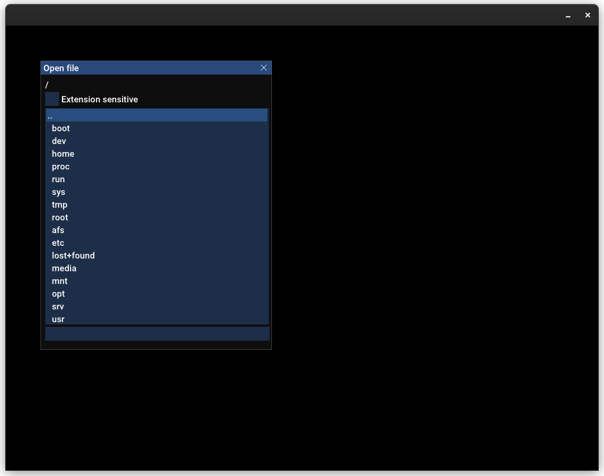

# Media editor template

It is a SFML-based general purpose editor (viewer) template.



## Features:

### Key bindings:
```
m_window->addKeyDownEvent(sf::Keyboard::O, ModifierKey::Control, ...some_function... );
```
### Single time any key down event
```
// export file example
m_window->addKeyDownEvent(sf::Keyboard::E, ModifierKey::Control | ModifierKey::Shift,
    [this]() {
        m_window->setAnyKeyReason("export file type");            // call here
        m_window->setTitle("Export shader as: G-glsl, H-hlsl");
    });
    
// receive here, this function will be called on any key single time after "setAnyKeyReason"
m_window->setAnyKeyDownOnceEvent("export file type",
    [this](KeyWithModifier key) {
        std::string shaderText;
        ShaderType shaderExportType;
        switch (key.key) {
        case sf::Keyboard::G: shaderExportType = UVBSP::ShaderType::GLSL; break;
        case sf::Keyboard::H: shaderExportType = UVBSP::ShaderType::HLSL; break;
        default: { 
            m_window->setTitle("Invalid export letter, press 'G' or 'H' next time.");
            return; }
        }
        // for example: do export stuff
    });
```
### Mouse event bindings:
```
m_window->setMouseDragEvent(sf::Mouse::Middle,
   [this](ivec2 startPos, ivec2 currentPos, ivec2 currentDelta, DragState dragState) {
       vec2 textureSize = toFloat(m_texture.getSize());
       vec2 uvCurrentDelta = m_window->mapPixelToCoords(currentDelta) / textureSize;
       vec2 uvStartPos = m_window->mapPixelToCoords(startPos) / textureSize;
       vec2 uvCurrentPos = m_window->mapPixelToCoords(currentPos) / textureSize;
       vec2 uvCurrentDir = normalized(uvCurrentPos - uvStartPos);

       if (dragState == DragState::StartDrag) {
         // when start dragging
       } else if (dragState == DragState::ContinueDrag) {
         // when continue dragging
       }
       // do something on MMB drag
   });

m_window->setMouseDownEvent(sf::Mouse::Left, [this](ivec2 pos, bool mouseDown) {
         if (mouseDown) { /* on mouse down */ 
         } else {
          // on mouse up, maybe it is better to separate these events
         }
     });
```
### Read/write file dialogs
```
// read(write)functions are bool(const std::filesystem::path& fullFilePath)
// (return success of read/write)
addFileInteractionInfo("Primary", "png,jpg", readFunction, writeFunction);

// open file
m_window->addKeyDownEvent(sf::Keyboard::O, ModifierKey::Control,
    std::bind(&Application::openFileDialog, this, "Primary"));

// save file
m_window->addKeyDownEvent(sf::Keyboard::S, ModifierKey::Control,
    std::bind(&Application::saveFileOptionalDialog, this, "Primary", false));

// save file as
m_window->addKeyDownEvent(sf::Keyboard::S, ModifierKey::Control | ModifierKey::Shift,
    std::bind(&Application::saveFileOptionalDialog, this, "Primary", true));

// you can add additional file import
addFileInteractionInfo("VectorFormatImport", "svg", readFunction, writeFunction);
m_window->addKeyDownEvent(sf::Keyboard::I, ModifierKey::Control,
    std::bind(&Application::openFileDialog, this, "VectorFormatImport"));
```

## Feel free to use and/or make it better!

# Dependencies:
- SFML
