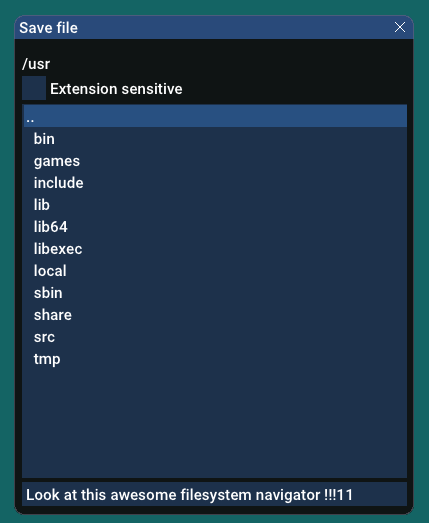

# Media editor template

It is a SDL2-based general purpose editor (viewer) template.


## Key input features:

### Key bindings:
```
m_window->addKeyDownEvent(SDLK_o, KMOD_CTRL, some_function );
```

### One time press event:

<details>
  <summary>Hidden here</summary>

Export shader type example
On one time press activation app will be waiting for a key press.

Behavior of code below:
- press "Ctrl + E"
- window title changes to "Export shader as: G-glsl, H-hlsl"
- if press G or H - window title "Successfully exported"
- if another key "Invalid key, press 'G' or 'H' next time."
- if G or H were binded to another function - app will not call them this time

```
m_window->addKeyDownEvent(SDLK_e, KMOD_CTRL,
    [this]() {
        m_window->activateOneTimePressEvent("shader export type");
        m_window->setTitle("Export shader as: G-glsl, H-hlsl");
    });

m_window->setOneTimePressEvent("shader export type",
    [this](KeyWithModifier key) {
        switch (key.key) {
        case SDLK_g: {
            // export as GLSL code here
            m_window->setTitle("Successfully exported as GLSL");
        } break;
        case SDLK_h: {
            // export as HLSL code here
            m_window->setTitle("Successfully exported as HLSL");
        } break;
        default: { 
            m_window->setTitle("Invalid key, press 'G' or 'H' next time.");
            // maybe reset to default title after delay
            return;
        }
        }

    });
```
</details>

### Mouse event bindings:
```
// drag view on MMB
m_window.setMouseDragEvent(MouseButton::Middle,
    [this](glm::ivec2 startPos, glm::ivec2 currentPos, glm::ivec2 currentDelta, DragState dragState) 
    {
        m_camera.addOffset_View(glm::vec2(-currentDelta));
    }
);
```
## File read/write:
### Add file read/write template:
```
// add "PrimaryImage" template for reader and writer, with supported extensions (png, jpg)
addFileInteractionInfo("PrimaryImage", "png,jpg", imageReaderFunction, imageWriterFunction);

// On "Ctrl + O" open file
// After open file confirmation in dialog window it will 
// use a reader function from "PrimaryImage" template.
// On "extension sensitive" enabled - it will filter files by extensions above.

m_window.addKeyDownEvent(SDLK_o, KMOD_CTRL, std::bind(&Application::openFileDialog, this, "PrimaryImage"));

// "Ctrl + S" save file
// The last bool argument "false" - it will automatically overwrite already opened file with imageWriterFunction.
// If it is a new file - it will open file dialog.

m_window.addKeyDownEvent(SDLK_s, KMOD_CTRL, std::bind(&Application::saveFileOptionalDialog, this, "PrimaryImage", false));

// "Ctrl + Shift + S" save file as
// The last bool argument "true" - it will always open file dialog.

m_window.addKeyDownEvent(SDLK_s, KMOD_CTRL | KMOD_SHIFT, std::bind(&Application::saveFileOptionalDialog, this, "PrimaryImage", true));

// You can add more readers/writers
// For example, add import/export and bind them to "Ctrl + I", "Ctrl + E"
```

### FileSystemNavigator

<details>
  
FileSystemNavigator can:
- Write filename in textbox, highlight text, if filemane exists or not exists in this folder.
- Show overwrite dialog window ("yes"/"no"), if you are going to overwrite file.
- Extension sensitive filter.
- Autocomplete first supported extension if not exists.
- launch individual save/read functions for each extension.
You can use it independently.



I did not try it on Windows, so it may not be able to change disks (now).
</details>


## Graphics features

DOF multipass dragon from openglapp3d.h example


### FrameBuffer

Place, where to draw something.

Abstract class: GLFrameBufferBase, is inherited by Window and GLFrameBuffer.

GLFrameBuffer - virtual buffer, has its own texture, that can be retrieved getTexture() and applied to any visual object as shader variable.

<details>
    <summary>GLFrameBuffer example</summary>

```
// declare it in calss members 
GLFrameBuffer m_fb;

// in init()
m_fb.create({ 2048, 2048 }, GLTexture2D::Format::RGBA_8);
m_fb.getTexture()->setFiltering(GLTexture2D::Filtering::LinearMipmap);
m_fb.getTexture()->setWrapping(GLTexture2D::Wrapping::ClampEdge);
m_fb.setClearColor({ .23f, .24f, .25f, 1.f });

// you may bind it manually
m_fb.bind();
m_fb.clear();
m_shader.setUniforms(...camera info...);
m_shader.setUniforms(...someVisualObject info...);
m_shader.applyUniforms();
someVisualObject.draw();

// but better use GLRenderManager
// draw someVisualObject to Framebuffer m_fb, with null camera, with clear enabled "true"
// (null camera sets shader camera matrix to identity)
renderManager.draw(&m_fb, &m_shaderDefault2d, nullptr, someVisualObject, true);

// the same way you can draw to window

```
</details>

### Shader

A class with stored shader uniforms.

Available types: float, glm::vec2, glm::vec3, glm::vec4, glm::mat4, int, glm::ivec2, glm::ivec3, glm::ivec4, Texture2Ddata. Default values are 0, except glm::mat4 - identity matrix.

Shader uniform is set by key (hash string) and std::variant of types above.

<span style="color:red">To be continued...</span>


## How to add it to your project
For CMake noobs like me.

This repo is your child project, the parent project is your "main".
CMake in your root project:
```
set(MediaEditorTemplate "third_party/media-editor-template") # something like set variable, to get it write ${MediaEditorTemplate}
add_subdirectory(${MediaEditorTemplate}) # important!

set(SOURCE_FILES main.cpp) # the "main" of your project
add_executable(${PROJECT_NAME} ${SOURCE_FILES})

include_directories(${MediaEditorTemplate}/src) # to find includes do this
target_link_libraries(${PROJECT_NAME} media-editor-template)  # undefined reference without this
```

Trust me, I brute-forced a lot of words in CMake!

Your main:
```
#include "application.h"

class MyApp : public Application {
  void init() override; // see examples
  updateWindow() override;
};

int main()
{
    MyApp app;
    app.init(); 
    app.mainLoop();
    return 0;
}

```

## Feel free to use and/or make it better!

### Dependencies:
- SDL2
- GLM

### Thirdparty:
- ImGUI
- stb_image, stb_image_write
- tiny_obj_loader