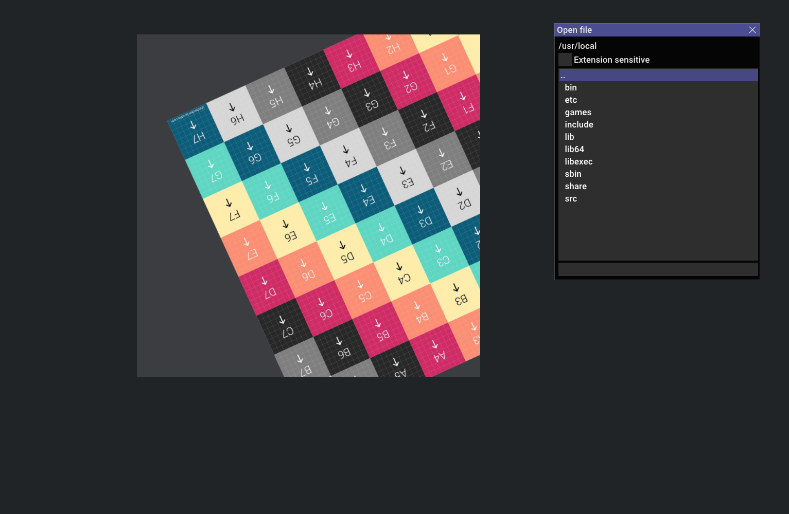

# Media editor template

It is a SDL2-based general purpose editor (viewer) template.



# Key features:

## Bind-less OpenGL rendering

Media-editor-template helps you to take away from OpenGL's state machine bindings. And make it as straightforward as possible.

<b>RenderManager</b> takes all pipeline problems. To draw something you must specify next function parameters:
- Where to draw: (<b>GLFrameBufferBase</b>: buffer or window)
- Which shader to use (<b>GLShader</b>)
- Which camera is looking (<b>CameraBase</b>, if no camera - default variables are set),
- What to draw: (<b>VisualObjectBase</b>, an object, that contains mesh and uniforms)
- Render parameters (<b>GLRenderParameters</b>, maybe will be params of object, not current render pass)

Key classes and types:

<b>UniformVariant</b> is uniform data itself: float, vec2, vec3, vec4, mat4, int, ivec2, ivec3, ivec4, Texture2D. They are defined in shader.h, and will be expanded if necessary.

<b>UniformContainer</b> is unordered map of HashString and UniformVariant.
Cameras and VisualObjects have uniform containers.

- If uniform is specified in shader, but not in VisualObject - they will be reset to default in GLShader::applyUniforms (all zero-s, except glm::mat4 is identity matrix).

- If uniform variable is specified in object, but not in current shader - nothing will happens.

So, you can draw the same object with different shaders, and corresponding variables will be applied in different shaders. 

You can't apply a wrong uniform type (e.g. mat4 in shader must be applied by glm::mat4, not float or texture).


<b>GLFrameBufferBase</b> (inherited in GLFrameBuffer, Window) - the place, where to draw something. After "render to texture" - texture's mipmaps will be automatically updated when as soon as texture will be binded.

<b>GLShader</b> - OpenGL shader wrapper.
All you need - is just complie it from text or source file, and use in RenderManager::draw.
Not recommended to use any other function, it may cause state machine inconsistency. For mode details - see description in code.

<b>Camera</b> is a uniform container with camera transform functions. Once, you have assigned camera uniform - it is marked as UniformType::Camera in shader, and is forbidden be applied by VisualObject (assert), e.g. "projectionMatrix", defined in Camera can not be overwritten by the same name variable in VisualObject. So, for camera and objects use separate uniform names.

<b>VisualObject</b> is a mesh with uniform container. Before draw call all the corresponding uniforms will be applied to shader, all unset variables will be reset to default. So, if shader contains "uniform vec3 objectColor", but uniform container - has no "objectColor" - shader's objectColor will be reset to vec3(0,0,0).


### Key bindings:
```
m_window->addKeyDownEvent(SDLK_o, KMOD_CTRL, some_function );
```

### One time press event:

<details>
  <summary>Hidden here</summary>

Export shader type example
On one time press activation app will be waiting for a key press.

Behavior of code below:
- press "Ctrl + E"
- window title changes to "Export shader as: G-glsl, H-hlsl"
- if press G or H - window title "Successfully exported"
- if another key "Invalid key, press 'G' or 'H' next time."
- if G or H were binded to another function - app will not call them this time

```
m_window->addKeyDownEvent(SDLK_e, KMOD_CTRL,
    [this]() {
        m_window->activateOneTimePressEvent("shader export type");
        m_window->setTitle("Export shader as: G-glsl, H-hlsl");
    });

m_window->setOneTimePressEvent("shader export type",
    [this](KeyWithModifier key) {
        switch (key.key) {
        case SDLK_g: {
            // export as GLSL code here
            m_window->setTitle("Successfully exported as GLSL");
        } break;
        case SDLK_h: {
            // export as HLSL code here
            m_window->setTitle("Successfully exported as HLSL");
        } break;
        default: { 
            m_window->setTitle("Invalid key, press 'G' or 'H' next time.");
            // maybe reset to default title after delay
            return;
        }
        }

    });
```
</details>

### Mouse event bindings:
```
// drag view on MMB
m_window.setMouseDragEvent(MouseButton::Middle,
    [this](glm::ivec2 startPos, glm::ivec2 currentPos, glm::ivec2 currentDelta, DragState dragState) 
    {
        m_camera.addOffset_View(glm::vec2(-currentDelta));
    }
);
```
## File read/write:
### Add file read/write template:
```
// add "PrimaryImage" template for reader and writer, with supported extensions (png, jpg)
addFileInteractionInfo("PrimaryImage", "png,jpg", imageReaderFunction, imageWriterFunction);

// On "Ctrl + O" open file
// After open file confirmation in dialog window it will 
// use a reader function from "PrimaryImage" template.
// On "extension sensitive" enabled - it will filter files by extensions above.

m_window.addKeyDownEvent(SDLK_o, KMOD_CTRL, std::bind(&Application::openFileDialog, this, "PrimaryImage"));

// "Ctrl + S" save file
// The last bool argument "false" - it will automatically overwrite already opened file with imageWriterFunction.
// If it is a new file - it will open file dialog.

m_window.addKeyDownEvent(SDLK_s, KMOD_CTRL, std::bind(&Application::saveFileOptionalDialog, this, "PrimaryImage", false));

// "Ctrl + Shift + S" save file as
// The last bool argument "true" - it will always open file dialog.

m_window.addKeyDownEvent(SDLK_s, KMOD_CTRL | KMOD_SHIFT, std::bind(&Application::saveFileOptionalDialog, this, "PrimaryImage", true));

// You can add more readers/writers
// For example, add import/export and bind them to "Ctrl + I", "Ctrl + E"
```

### FileSystemNavigator

<details>
  
FileSystemNavigator can:
- Write filename in textbox, highlight text, if filemane exists or not exists in this folder.
- Show overwrite dialog window ("yes"/"no"), if you are going to overwrite file.
- Extension sensitive filter.
- Autocomplete first supported extension if not exists.
- launch individual save/read functions for each extension.
You can use it independently.


I did not try it on Windows, so it may not be able to change disks (now).
</details>


## How to add it to your project
For CMake noobs like me.

This repo is your child project, the parent project is your "main".
CMake in your root project:
```
set(MediaEditorTemplate "third_party/media-editor-template") # something like set variable, to get it write ${MediaEditorTemplate}
add_subdirectory(${MediaEditorTemplate}) # important!

set(SOURCE_FILES main.cpp) # the "main" of your project
add_executable(${PROJECT_NAME} ${SOURCE_FILES})

include_directories(${MediaEditorTemplate}/src) # to find includes do this
target_link_libraries(${PROJECT_NAME} media-editor-template)  # undefined reference without this
```

Trust me, I brute-forced a lot of words in CMake!

Your main:
```
#include "application.h"

class MyApp : public Application {
  void init() override; // see examples
  updateWindow() override;
};

int main()
{
    MyApp app;
    app.init(); 
    app.mainLoop();
    return 0;
}

```


## Feel free to use and make it better!

### Dependencies:
- SDL2
- GLM

### Thirdparty:
- ImGUI
- stb_image, stb_image_write
- tiny_obj_loader